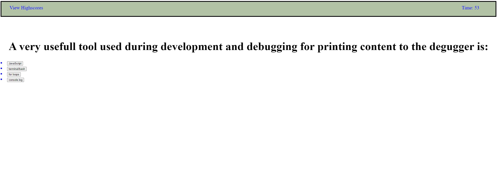

# Coding_Quiz

## Description
A timed quiz that will present a series of questions with a timer  and penalties for wrong answer.

* **Add a timer and present a question.**
* **When answered, add another question.**
* **If a question is wrong, penalize with 10 seconds.**
* **Sto quiz when timer is cero or no more questions**
* **Save initial and score.**

## Installation
N/A

## Usage
To use this coding quiz, you can open it in a browser. Then click the Start button and answer the questions

The following image shows the web application's appearance and functionality:

Credits
N/A

License
MIT